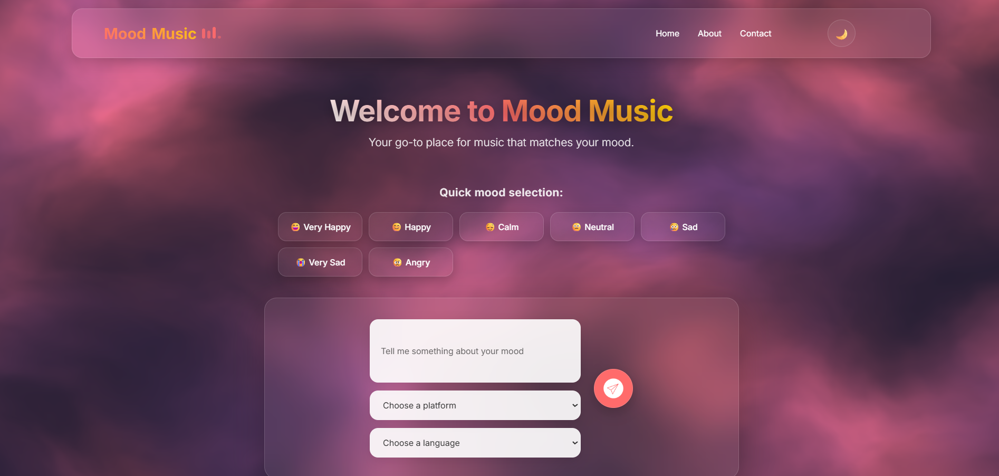
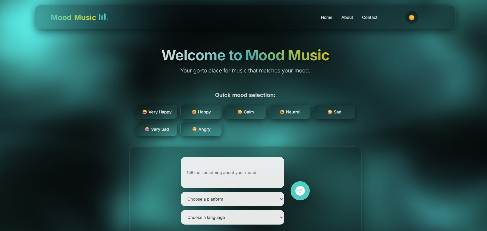
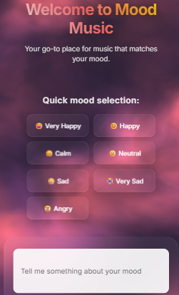
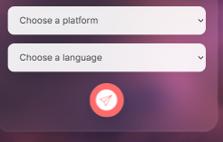

# 🎵 Mood Music Generator

<div align="center">


**Discover music that matches your emotions with AI-powered sentiment analysis**

[](https://python.org)
[](https://fastapi.tiangolo.com)
[](https://developer.mozilla.org/en-US/docs/Web/JavaScript)
[](https://developer.spotify.com)

[🚀 Live Demo](#) • [📖 Documentation](#features) • [🛠️ Installation](#installation) • [🤝 Contributing](#contributing)

</div>

---

## ✨ Features

### 🎯 **AI-Powered Mood Detection**
- Advanced sentiment analysis using NLTK's VADER analyzer
- Understands nuanced emotions from text input
- Supports 7 different mood categories: Very Happy, Happy, Calm, Neutral, Sad, Very Sad, Angry

### 🎵 **Multi-Platform Music Discovery**
- **Spotify Integration**: Direct embedded players for instant listening
- **YouTube Integration**: Search and discover music videos
- **Dual Platform Support**: Get recommendations for both platforms simultaneously

### 🌍 **Multi-Language Support**
- English, Hindi, Punjabi, Bengali music recommendations
- Language-specific mood analysis for better accuracy
- Cultural diversity in music discovery

### 🎨 **Beautiful Modern UI**
- Glassmorphism design with animated backgrounds
- Dark/Light theme with persistent preferences
- Fully responsive design for all devices
- Interactive Vanta.js fog animations

### 📱 **Mobile Optimized**
- Touch-friendly interface with haptic feedback
- Responsive grid layouts for all screen sizes
- Optimized performance for mobile devices
- PWA-ready architecture

---

## 🖼️ Screenshots

<div align="center">

### 🏠 Home Page



### 🎵 Music Recommendations


### 📱 Mobile Experience



</div>

---

## 🚀 Quick Start

### Prerequisites
- Python 3.8+
- Node.js (for development)
- Spotify Developer Account

### 🛠️ Installation

1. **Clone the repository**
   ```bash
   git clone https://github.com/abhayshaw1601/mood-music-generator.git
   cd mood-music-generator
   ```

2. **Install Python dependencies**
   ```bash
   pip install fastapi uvicorn spotipy nltk python-dotenv
   ```

3. **Set up environment variables**
   ```bash
   # Create .env file
   echo "client_id=your_spotify_client_id" > .env
   echo "client_secret=your_spotify_client_secret" >> .env
   ```

4. **Download NLTK data**
   ```python
   import nltk
   nltk.download('vader_lexicon')
   ```

5. **Start the server**
   ```bash
   python main.py
   ```

6. **Open your browser**
   Navigate to `http://localhost:5000` and start discovering music! 🎉

---

## 🏗️ Architecture

### Backend (FastAPI)
```
main.py
├── FastAPI application
├── Spotify API integration
├── NLTK sentiment analysis
├── CORS middleware
└── Pydantic data models
```

### Frontend (Vanilla JS)
```
├── index.html          # Main application
├── about.html          # About page
├── contact.html        # Contact page
├── style.css           # Responsive styling
├── script.js           # Core functionality
└── assets/             # Images and icons
```

### Key Technologies
- **Backend**: FastAPI, Spotipy, NLTK, Uvicorn
- **Frontend**: Vanilla JavaScript, CSS3, HTML5
- **Animations**: Vanta.js, Anime.js, Vanilla Tilt
- **APIs**: Spotify Web API, YouTube Search

---

## 🎯 How It Works

1. **Input Processing**: User enters mood description or selects quick mood buttons
2. **Sentiment Analysis**: NLTK VADER analyzer processes the text for emotional content
3. **Music Search**: Spotify API searches for songs matching the detected mood
4. **Results Display**: Songs are presented with embedded players and external links
5. **Multi-Platform**: Users can listen on Spotify or discover on YouTube

### Mood Detection Algorithm
```python
def detect_mood(text):
    score = sia.polarity_scores(text)
    compound = score["compound"]
    
    if compound >= 0.6: return "very happy"
    elif 0.3 <= compound < 0.6: return "happy"
    elif 0.05 <= compound < 0.3: return "calm / relaxed"
    elif -0.05 < compound < 0.05: return "neutral"
    elif -0.3 <= compound <= -0.05: return "sad"
    elif -0.6 <= compound < -0.3: return "very sad"
    else: return "angry"
```

---

## 🎨 Design System

### Color Palette
- **Primary**: `#667eea` → `#764ba2` (Purple Gradient)
- **Accent**: `#ff6b6b` (Coral Red)
- **Dark Accent**: `#4ecdc4` (Teal)
- **Glass**: `rgba(255, 255, 255, 0.1)` (Glassmorphism)

### Typography
- **Font Family**: Inter (Google Fonts)
- **Weights**: 300, 400, 500, 600, 700

### Animations
- **Entrance**: Fade in with staggered delays
- **Interactions**: Scale and translate transforms
- **Background**: Vanta.js fog effect with theme-aware colors

---

## 📱 Mobile Features

- **Responsive Grid**: Adapts from 4→3→2→1 columns based on screen size
- **Touch Optimization**: 44px minimum touch targets
- **Performance**: Reduced animations and optimized Vanta effects
- **Gestures**: Touch-friendly interactions with visual feedback
- **Orientation**: Handles landscape/portrait mode changes

---

## 🔧 API Reference

### Get Song Recommendations
```http
POST /get_songs
Content-Type: application/json

{
  "message": "I'm feeling happy today",
  "platform": "both",
  "language": "english"
}
```

**Response:**
```json
{
  "mood": "happy",
  "songs": [
    {
      "name": "Happy Song",
      "artist": "Artist Name",
      "spotify": "https://open.spotify.com/track/...",
      "youtube": "https://www.youtube.com/results?search_query=..."
    }
  ]
}
```

---

## 🤝 Contributing

We welcome contributions! Here's how you can help:

### 🐛 Bug Reports
- Use the [issue tracker](https://github.com/abhayshaw1601/mood-music-generator/issues)
- Include steps to reproduce
- Provide browser/device information

### ✨ Feature Requests
- Check existing issues first
- Describe the feature and use case
- Consider implementation complexity

### 🔧 Development Setup
```bash
# Fork the repository
git clone https://github.com/abhayshaw1601/mood-music-generator.git

# Create feature branch
git checkout -b feature/amazing-feature

# Make changes and commit
git commit -m "Add amazing feature"

# Push and create pull request
git push origin feature/amazing-feature
```

---

## 📄 License

This project is licensed under the MIT License - see the [LICENSE](LICENSE) file for details.

---

## 🙏 Acknowledgments

- **Spotify** for their comprehensive Web API
- **NLTK** for powerful sentiment analysis tools
- **Vanta.js** for beautiful animated backgrounds
- **FastAPI** for the modern, fast web framework
- **Inter Font** by Rasmus Andersson

---

## 📞 Support

- 📧 **Email**: [hello@moodmusic.com](shaw95000@gmail.com)
- 🐛 **Issues**: [GitHub Issues](https://github.com/abhayshaw1601/mood-music-generator/issues)
- 💬 **Discussions**: [GitHub Discussions](https://github.com/abhayshaw1601/mood-music-generator/discussions)

---

<div align="center">

**Made with ❤️ and 🎵 by [Abhay Shaw](https://github.com/abhayshaw1601)**

⭐ **Star this repo if you found it helpful!** ⭐

</div>